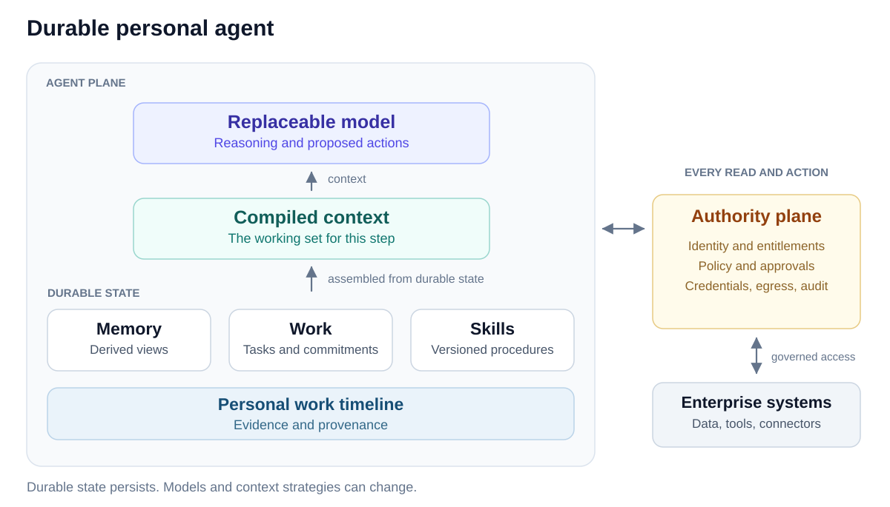

# From Personal Timeline to a Durable Personal Agent

*Lambert Mathias · October 1, 2026*

## The proposal

Build a **personal, always-on enterprise agent** that helps an employee carry work forward across conversations, applications, and time.

> **“Own my preparation for this account and keep me current.”**

The agent maintains the account's working picture, tracks unresolved commitments, incorporates relevant developments, and prepares the employee before meetings. The employee can inspect its evidence, correct its understanding, change its scope, or pause the responsibility without starting over.

**Personal means continuity in what the agent remembers.** A personal timeline records the employee's relevant work and interactions: messages, meetings, document changes, decisions, commitments, user corrections, and agent actions and outcomes. It preserves evidence about what happened. A memory agent uses that evidence to decide what matters to retain and what to surface for a particular task, under the user's preferences and sharing settings.

**Always-on means continuity in how the agent works.** Durable sessions preserve ongoing responsibilities, task state, waits, and progress across disconnects, process failures, and model changes. Relevant events—new messages, changed documents, upcoming meetings—or scheduled conditions resume authorized work. The agent continues responsibly under current permissions and user instructions, and surfaces material results without requiring another prompt. It need not run an LLM continuously.

The technical foundation combines a personal evidence timeline, agent-managed memory, durable execution, event subscriptions, compiled task context, and independently enforced authority.

> **The timeline is evidence. Memory is computed from it. Work is durable. Context is compiled. Authority is external.**

**The personal timeline supports what matters to remember across time. Always-on execution supports continuing work responsibly across time.**

No amount of accumulated memory increases authority.

## Why now

Recent systems provide useful precedents for different parts of this design. Their capabilities support the proposed direction; they do not establish its reliability at enterprise scale.

- **[Pi Durable](https://earendil.com/posts/pi-durable/)** makes model calls, tools, and compaction checkpointed tasks; retains transcripts after context resets; and commits typed application state alongside the transcript. Its experimental runtime distinguishes exactly-once submission from safe tool replay. This is the central systems insight: execution state can persist independently of model context.
- **[Manus](https://manus.im/blog/Context-Engineering-for-AI-Agents-Lessons-from-Building-Manus)** externalizes bulky observations to addressable files and references. Context can shrink while omitted evidence remains recoverable.
- **[OpenClaw](https://docs.openclaw.ai/concepts/memory-architecture)** separates episodic evidence, curated memory, and prospective intents, with provenance and gates for memory promotion. Intent lifecycle and matching live in code rather than depending on recall alone.
- **[Muse](https://introducing.muse.ai/)** combines an agent workspace, background execution, event-driven follow-up, and visible goals and activity. Its [Sentinel security boundary](https://security.muse.ai/) mediates access, credentials, approvals, and egress independently of agent reasoning.

The opportunity is to combine these ideas around persistent enterprise responsibilities, with explicit provenance and authority boundaries.

## Architecture

The agent plane maintains work, compiles context, and proposes operations. The authority plane mediates access to enterprise systems, including event subscriptions, tool execution, writes, and notifications. Authorized observations return to the timeline and runtime; there is no direct path from the model to enterprise systems.

Model weights, retrieval indexes, prompts, and context strategies can change. The enterprise retains the evidence record, operational state, authorization policy, versioned procedures, and evaluation corpus. **Task state is authoritative operational state; it must not depend on reconstruction from a transcript.**

### Five capabilities within the agent plane

The [engineering architecture](docs/architecture.md) expands these five capabilities: task agents query a user-representing memory agent, whose synchronous retrieval and asynchronous maintenance share the same timeline under the user constitution.

**1. Timeline: what happened.** An append-oriented evidence record spanning relevant messages, meetings, document versions, observations, actions, approvals, corrections, and outcomes. Events carry source, actor, time, trust, entitlement and retention metadata, and artifact references. Corrections normally add evidence; retention, deletion, and legal holds govern what remains available. The record preserves observations and claims without treating every claim as true. The [timeline event specification](docs/timeline-events.md) defines the key interactions captured from Outlook email, Calendar, OneDrive, Word, and LLMSuite conversations and tasks: compact events and source references, with detail retrieved through governed connector tools when needed.

**2. Agentic memory: what we know and what a task may see.** A memory agent represents the user across tasks. It maintains derived views and programs over timeline evidence through asynchronous tools for writing, updating, dreaming, and consolidation. Synchronous tools query and retrieve memory for the current task. Task agents cannot access personal memory directly: the memory agent selects permitted information and its representation under the user constitution and enterprise permissions. Derived artifacts retain provenance, temporal validity, and versions so that corrections can invalidate or repair them. The model can choose their organization; preferences, entities, and summaries are possible views, not required memory categories.

**3. Durable work: what continues.** Tasks, plans, typed application state, waits, retries, deadlines, approvals, and commitments survive failures and context resets. Standing conditions and subscriptions are evaluated against incoming enterprise events, waking work without continuous inference. Intent state includes scope, expiry, cooldown, and cancellation. Event delivery requires deduplication and recovery from missed delivery.

Durability alone does not make external actions exactly-once. Connectors need stable operation IDs, idempotency where supported, and reconciliation when an action may have succeeded before its result was recorded. An ambiguous non-idempotent operation pauses for resolution rather than being blindly replayed. Recovery rechecks current authority before continuing.

**4. Skills: what we know how to do.** Governed, versioned procedures implement recurring retrieval, transformations, checks, and recovery behavior. Traces can suggest improvements, but successful repetition alone does not authorize promotion. Procedures remain independently testable and replaceable as models improve.

**5. Context compiler: what this model needs now.** A task agent requests context from the memory agent, which selects and represents permitted evidence under the user constitution. The compiler combines that response with durable task state, policy, and skills to materialize the next model input. The task model can reorganize its approved working view and request more through the same mediated interface. Context budgets and formats can vary by model. Nothing required for continuity exists only in the prompt.

Compaction may use summaries, provided omitted evidence retains resolvable references under retention policy. A URL alone is insufficient when the original observation must be reconstructed; retain a permitted source version or snapshot. Log the compiled context or a reconstructable manifest, its integrity hash, model and program versions, and the resulting action. A hash verifies retained content; it cannot reconstruct missing content or reproduce a model's reasoning.

Recomputing memory and context is distinct from execution recovery. Rebuilding a view never re-executes external side effects.

## Enterprise constraints

Persistent agents accumulate both evidence and opportunities to act. The **user constitution** records the user's sharing settings, task and purpose boundaries, and context-presentation preferences. Enterprise authority bounds what it can permit. Reads and disclosures are checked against current identity, entitlements, classification, approval scope, and information barriers outside model control.

| Constraint | Required behavior |
| --- | --- |
| **Retention and deletion** | Expiry or deletion propagates through source copies, indexes, projections, cached context, and other dependent artifacts, subject to legal holds. Audit retention follows its own approved policy. |
| **Revoked access** | A source that is no longer authorized cannot influence future context or actions through a cached summary or derived artifact. Invalidate affected views, rebuild from permitted evidence, and stop or re-scope affected work. |
| **Information barriers** | Derived summaries and procedures preserve contributing sources' restrictions. Mixed-source artifacts cannot cross a barrier simply because the original content was transformed. |
| **Untrusted content** | Source trust propagates into projections and context. Instructions in retrieved content cannot create capabilities or approvals; enforcement lives in the authority plane. |
| **Auditability** | Retain policy-permitted inputs or references, operation IDs, tool results, versions, policy decisions, and approvals sufficient to establish what an action was based on and why it was permitted. |

Revocation can stop future use; it cannot erase information already shown to a person or undo a completed action. That makes authorization at both context construction and execution essential.

## Proactivity and learning

An ongoing responsibility needs both a wake-up rule and an interruption rule. Incoming events or timers resume authorized work. The runtime then decides whether a result should update the workspace silently, wait for the next interaction, or notify the employee. Evaluate material developments surfaced and missed alongside unnecessary interruptions; alert volume alone measures little.

Verified execution traces can improve retrieval programs, context policies, skills, routing, and verification. Learning has three gates:

- **Evidence:** distinguish verified outcomes from model assertions before promoting a derived claim or procedure.
- **Boundary:** preserve source restrictions. Cross-user procedures require explicit clearance and evaluation for embedded confidential content; abstraction alone does not establish that they are safe to share.
- **Acceptance:** review candidate changes, initially with human approval, then test them against held-out tasks for success, safety, cost, and regression before deployment. Version and roll back accepted changes.

The execution corpus compounds only within its permitted use and retention boundaries.

## Build sequence and evaluation

The first milestone is a multi-session responsibility that survives an injected process restart and model swap, incorporates a new enterprise event, and resumes with correct state and no lost or duplicated side effects in the tested connectors.

**Durability → Context → Proactivity → Learning**

| Stage | Build | Exit criterion |
| --- | --- | --- |
| **Durability** | Timeline, checkpointed tasks, typed state, event ingestion, governed connectors, and operation audit. | A multi-session task passes injected restarts and a model swap, incorporates a new event, and preserves state. Tested connectors produce no lost or duplicated effects; ambiguous outcomes are explicitly reconciled or paused. |
| **Context** | Versioned projections, lineage, and a model-aware context compiler. | Correction, deletion, and revocation tests remove affected evidence from future contexts and actions, including through derived artifacts. Retained inputs can be reconstructed within audit policy. |
| **Proactivity** | Standing intents, subscriptions, lifecycle controls, and notification policy. | The agent surfaces relevant developments with measured coverage and interruption precision, and honors cancellation, expiry, and changed permissions. |
| **Learning** | Trace mining into candidate procedures and harness changes, with review and acceptance gates. | Accepted changes improve held-out task outcomes within agreed safety and cost bounds and can be rolled back. |

Track completion across sessions, recovery correctness, projection accuracy and staleness, proactive coverage and precision, cost per completed responsibility, and audit reconstruction time. Measure user value separately through preparation effort and missed commitments.

The remaining design questions are concrete: timeline fidelity and storage cost at firm scale; incremental versus batch projection maintenance; ownership and handover when an employee changes roles; and the review process for learned programs. These require implementation and evaluation rather than another memory taxonomy.

## North star

A personal enterprise agent carries work forward without making the employee reconstruct it each morning. It can show what changed, what remains outstanding, what it is doing, and under whose authority. As models improve, the same permitted evidence and durable work state support better reasoning and better procedures. The continuity belongs to the system; intelligence can keep changing.
