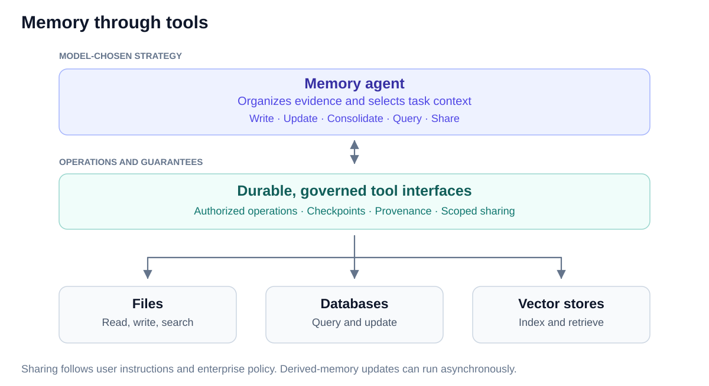

# Agentic Memory and Context Architecture

*Engineering expansion of the [five capabilities in the brief](../README.md#five-capabilities-within-the-agent-plane).*

A task agent decomposes a user request into memory queries. A user-representing memory agent answers those queries through retrieval and transformation tools, returning only query-relevant, permitted context. The same memory agent also maintains derived memory asynchronously. **Both modes read the same personal timeline and derived memory; storage mechanisms sit behind separate adapters.**

> **The timeline is evidence. Memory is computed from it. Work is durable. Context is compiled. Authority is external.**

## Capability boundaries

| Capability | Implementation responsibility |
| --- | --- |
| **1. Timeline** | Retain events, decisions, corrections, agent actions, and outcomes with provenance, trust, access, and retention metadata. Ground both execution modes. |
| **2. Agentic memory** | Maintain derived components and answer task-scoped queries under the user constitution and enterprise permissions. |
| **3. Durable work** | Checkpoint task sessions, memory requests, maintenance jobs, triggers, retries, and cancellation. |
| **4. Skills** | Supply versioned retrieval, maintenance, verification, and context-presentation programs. |
| **5. Context compiler** | Combine permitted memory responses with task state, policy, and skills to materialize the next task-model input. |

The [timeline event note](timeline-events.md) specifies the compact work ledger, source evidence references, and connector admission rules.

## Synchronous query path

1. **Decompose.** The task agent identifies missing information and generates one or more memory queries. It can issue additional queries as reasoning progresses.
2. **Authorize.** Bind each request to the actual caller and task scope. Apply the current user constitution and enterprise restrictions before retrieval and disclosure.
3. **Retrieve and transform.** The memory agent iterates through tools to search derived memory, consult timeline evidence, resolve references, reconcile conflicting claims, and construct the requested representation.
4. **Return.** Send a per-query answer or context package containing only relevant, permitted information. Return an explicit empty, partial, or denied result when appropriate.
5. **Compile and continue.** The compiler validates the package and combines it with task state and skills. The task agent reasons with that context and requests more through the same interface.

Task agents have no direct access to personal-memory stores or raw personal-timeline APIs. Returned references are resolved through the mediated interface; they do not confer broader access. A timeout must not enable a direct-store fallback.

| Request fields | Response fields |
| --- | --- |
| Query ID and information need; runtime-bound caller, task, and purpose; requested representation, freshness, and budget. | Answer/context payload; source references and dependencies; memory revision and timeline cursor; policy revision, freshness, and result status. |

Representations may include source excerpts, summaries, structured state, or references. The memory agent chooses an appropriate form within the query's requirements and sharing constraints.

## Asynchronous maintenance path

Timeline events, schedules, or explicit requests start durable maintenance jobs. The memory agent reads **both timeline evidence and existing derived memory**, then invokes tools to write, update, reconcile, consolidate, prune, reorganize, or refresh components and indexes.

Dreaming is background interpretation of retained experience. Its outputs remain derived claims or candidate procedures with source dependencies and verification status. Persistence alone does not verify them.

Publish updates as consistent, versioned revisions. Record the processed timeline cursor and program versions. Maintenance changes derived memory; source-evidence deletion follows retention policy, not a model's consolidation decision.

A synchronous query can consult newer timeline evidence even if maintenance has not processed it. If a task requires a specific derived update, it waits for that dependency; otherwise the response reports the version and freshness used. Long maintenance jobs should not block unrelated reads.

## Tools, logical memory, and storage

| Layer | Contract |
| --- | --- |
| **Memory tools** | Evidence search/query, reference resolution, verification/reconciliation, summarization, response pruning, representation selection, and derived-memory mutations. Available operations are scoped to the execution mode. |
| **Logical state** | Personal timeline plus model-organized derived artifacts, views, indexes, and programs. Both modes access both components under current permissions. |
| **Storage adapters** | Persistence and index operations over files/object stores, databases, or vector stores, with explicit commit and recovery semantics. |

Tools may be implemented as programs, database operations, or model-assisted transformations. Their interfaces prescribe operations and guarantees, not a fixed taxonomy of memory. The memory agent can change how it organizes evidence without changing task-side access contracts.

**Sync pruning removes irrelevant material from a response. Async pruning changes persistent derived memory.** Neither operation implicitly deletes timeline evidence.

## Policy, consistency, and recovery

- **User constitution:** versioned user settings for reuse, purpose, task/project boundaries, exclusions, and presentation preferences. Authorized user changes update it; the memory agent cannot relax its restrictions.
- **External enforcement:** runtime checks enforce sharing constraints, entitlements, information barriers, and approvals on reads and disclosure. Enterprise authority bounds the constitution. Summarization does not itself authorize release.
- **Invalidation:** corrections, deletion, revoked access, and constitution changes invalidate affected views, context packages, and dependent caches before subsequent use. Source dependencies and policy revisions support this.
- **Durability:** checkpoint both modes and task sessions independently of model context. Use operation IDs and idempotency for retries; reconcile ambiguous effects rather than blindly replaying them. View recomputation never re-executes external actions.
- **Audit:** retain permitted inputs or reconstructable references, revisions, tool results, policy decisions, and operation outcomes. Context edits cannot relabel provenance or cancel a durable responsibility.

## Acceptance checks

Test query relevance, representation fidelity, contradiction handling, source grounding, freshness, latency, and cost. Verify task-side bypass prevention, exclusions, changed constitution settings, deletion/revocation propagation, and injection resistance. Inject failures during retrieval, publication, and task execution; require correct recovery without lost or duplicated tested effects.

Storage/execution separation follows [Pi Durable](https://earendil.com/posts/pi-durable/). Editable working-context strategies are motivated by [Context Language Models](https://arxiv.org/html/2609.37725v1); mediated personal-memory access remains enforced regardless of the task model's context strategy.
